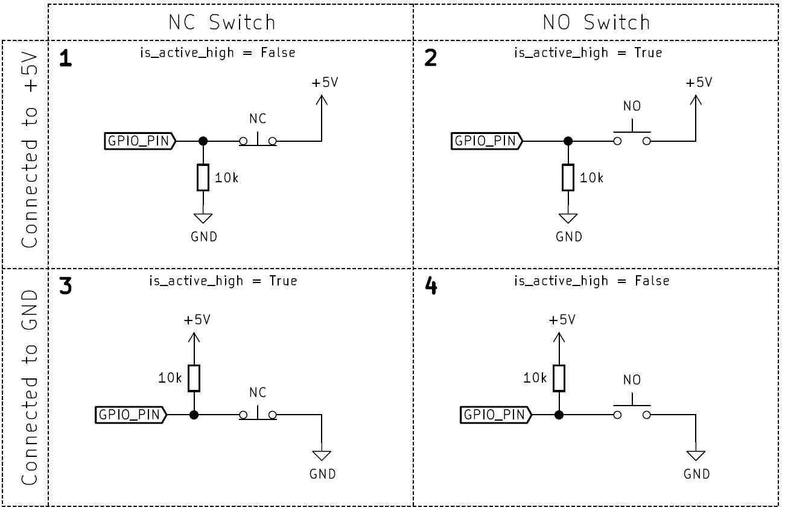

# Endstops

Endstops are used for both "homing" the axis of a machine and for stopping the machine in the event it attempts to go "out of bounds".

## Configuration Properties

Each axis has two endstops: a "min" and a "max".  Each endstop has the following properties:

Name |  Type | Default
--- | -- | -- 
gpio_num | int | 0
enabled | boolean | False
offset | int | 0
debounce_ms | float | 100.0
is_active_high | boolean | False


### gpio_num
The GPIO pin number, according to the silkscreen labels on ODrive

### enabled
Enables/disables detection of the endstop.  If disabled, homing and e-stop cannot take place.

### offset
This is the location along the axis, in counts, that the endstop is positioned at.  For example, if you want a position command of `0` to represent a position 100 counts away from the endstop, the offset would be -100 (because the endstop is at position -100)

### debounce_ms
The debouncing time, in milliseconds, for this endstop.  Most switches exhibit some sort of bounce, and this setting will help prevent the switch from triggering repeatedly. It works for both HIGH and LOW transitions, regardless of the setting of `is_active_high`.

### is_active_high
This is how you configure the endstop to be either "NPN" or "PNP".  An "NPN" configuration would be `is_active_high = False` whereas a PNP configuration is `is_active_high = True`.  Refer to the following table for more information:



3D printer endstops (like those that come with a RAMPS 1.4) are typically configuration **4**.

### Configuring an endstop

You can access these configuration properties through odrivetool.  For example, if we want to configure a 3D printer-style minimum endstop on GPIO 5 for homing, and you want your motor to pull off the endstop about a quarter turn with a 8192 cpr encoder, you would set:

```
<odrv>.<axis>.min_endstop.config.gpio_num = 5
<odrv>.<axis>.min_endstop.config.is_active_high = 4
<odrv>.<axis>.min_endstop.config.offset = -2048;
<odrv>.<axis>.min_endstop.config.enabled = True

<odrv>.save_configuration()
<odrv>.reboot()
```


## Homing

Homing is possible once the ODrive has closed loop control over the axis.  To trigger homing, we use must first be in AXIS_STATE_CLOSED_LOOP_CONTROL, then we call`<odrv>.<axis>.controller.home_axis()`  This starts the homing sequence.  The homing sequence works as follows:

1. Verify that the `min_endstop` is `enabled`
2. Drive towards the `min_endstop` in velocity control mode at `controller.config.homing_speed`
3. When the `min_endstop` is pressed, set the current position = `min_endstop.config.offset`
4. Request position control mode, and move to the positon = `0`

### Homing Speed
Homing speed is configurable through the value
`<odrv>.<axis>.controller.config.homing_speed` in counts/second.  It has the default value of 2000 counts/second.

Note the assumption is made that `min_endstop` is in the negative direction, thus the velocity commanded is `-controller.config.homing_speed`, which will drive the axis towards the endstop.  If you have an unusual setup and want to change this behaviour, simply use a negative value for `homing_speed`.

### Homing at startup
It is possible to configure the odrive to enter homing immediately at startup. For safety reasons, we require the user to specifically enable closed loop control at startup, even if homing is requested.  Thus, to enable homing at startup, the following must be configured:

```
<odrv>.<axis>.config.startup_closed_loop_control = True
<odrv>.<axis>.config.startup_homing = True
```
